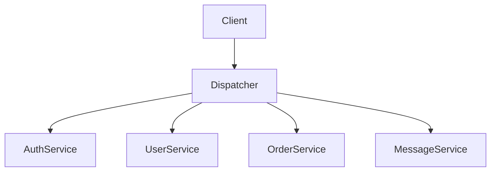
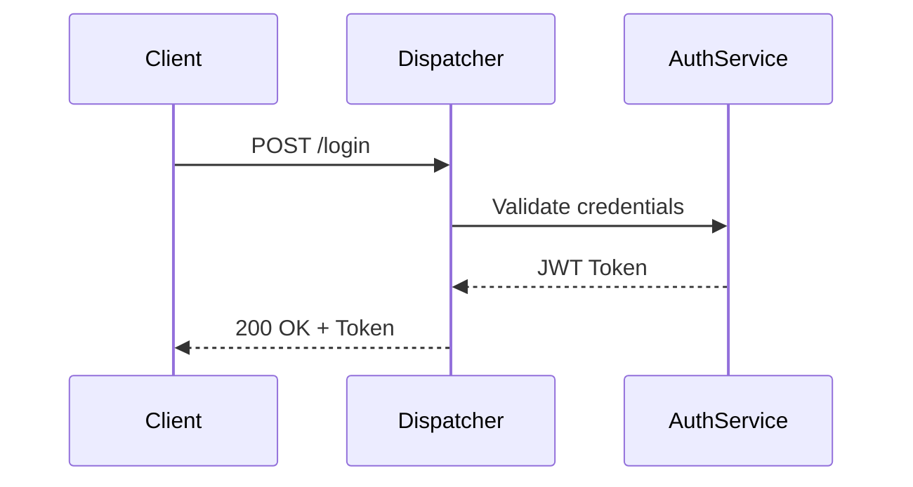

# Yazılım Geliştirme Laboratuvarı II  
## Microservice Dispatcher Project  

Öğrenci No: 211307040 
Ad Soyad:  Ahmet Tahsin Söylemez 
 
Tarih:  02.03.2026

---

## 1. Problem Tanımı

Bu proje, mikroservis mimarisi kullanılarak yüksek trafikli bir sistemde
servisler arası istek yönlendirmesinin merkezi bir Dispatcher (API Gateway)
üzerinden gerçekleştirilmesini amaçlamaktadır.

Sistem güvenli, ölçeklenebilir ve test odaklı geliştirme (TDD) yaklaşımı ile
tasarlanacaktır.

---

## 2. Mimari Tasarım

Sistem aşağıdaki bileşenlerden oluşmaktadır:

- Dispatcher (API Gateway)
- Auth Service
- User Service
- Order Service
- Message Service
- Her servis için izole NoSQL veri tabanı

---

## 3. Sistem Mimarisi Diyagramı


graph TD
    Client --> Dispatcher
    Dispatcher --> AuthService
    Dispatcher --> UserService
    Dispatcher --> OrderService
    Dispatcher --> MessageService

## 4. Sistem Mimarisi

Sistem, mikroservis mimarisi prensiplerine uygun olarak tasarlanmıştır.  
Tüm dış istekler yalnızca **Dispatcher (API Gateway)** üzerinden kabul edilmektedir.  
Mikroservisler dış dünyaya kapalı olup yalnızca iç ağ üzerinden erişilebilmektedir.

### Bileşenler

- Dispatcher (API Gateway)
- Auth Service
- User Service
- Order Service
- Message Service
- Her servis için izole MongoDB veri tabanı

---

### 4.1 Genel Mimari Diyagramı

Aşağıda sistemin genel mimari yapısı gösterilmektedir.




---

## 5. İş Akışı ve Sequence Diyagramları

### 5.1 Login İş Akışı

Kullanıcı sisteme giriş yapmak istediğinde aşağıdaki adımlar gerçekleşir:

1. Client, Dispatcher’a login isteği gönderir.
2. Dispatcher isteği Auth Service’e yönlendirir.
3. Auth Service kimlik doğrulama yapar.
4. Doğrulama başarılı ise JWT token üretir.
5. Dispatcher token’ı kullanıcıya iletir.




---

## 6. Richardson Olgunluk Modeli (RMM)

Bu projede RESTful servis tasarımında **Richardson Maturity Model Seviye 2** uygulanmaktadır.

### Seviye 2 Gereklilikleri

- Kaynakların URI ile tanımlanması  
- HTTP metodlarının doğru kullanılması (GET, POST, PUT, DELETE)  
- Uygun HTTP durum kodlarının döndürülmesi (200, 201, 400, 401, 404, 500 vb.)

### Doğru Kullanım Örnekleri

```
GET /users
POST /users
PUT /users/{id}
DELETE /users/{id}
```

### Yanlış Kullanım (Bu projede kullanılmayacaktır)

```
POST /deleteUser?id=1
```

---

## 7. Mikroservislerin Açıklaması

### 7.1 Dispatcher (API Gateway)

- Sistemin tek giriş noktasıdır.
- Yetkilendirme kontrolü merkezi olarak yapılır.
- İstekler URL yapısına göre ilgili mikroservise yönlendirilir.
- Hatalı durumlarda doğru HTTP hata kodları döndürülür.
- TDD yaklaşımı ile geliştirilmektedir.

---

### 7.2 Auth Service

- Kullanıcı kimlik doğrulama işlemlerini gerçekleştirir.
- JWT üretir.
- Yetki bilgileri NoSQL veri tabanında saklanır.

---

### 7.3 User Service

- Kullanıcı oluşturma, listeleme, güncelleme ve silme işlemlerini gerçekleştirir.
- Kendi izole MongoDB veri tabanına sahiptir.

---

### 7.4 Order Service

- Sipariş oluşturma ve yönetim işlemlerini gerçekleştirir.
- Yüksek trafik senaryosu bu servis üzerinden test edilecektir.
- Bağımsız veri tabanına sahiptir.

---

### 7.5 Message Service

- Kullanıcılar arası mesajlaşma işlemlerini yönetir.
- JSON formatında veri alışverişi yapar.
- İzole veri tabanına sahiptir.

---

## 8. Veri Tabanı Tasarımı

Her mikroservis kendi veri tabanına sahiptir ve veri izolasyonu sağlanmaktadır.

- Dispatcher DB
- Auth DB
- User DB
- Order DB
- Message DB

Bu izolasyon sayesinde servisler arası doğrudan veri erişimi engellenmektedir.


---

## 9. TDD (Test Driven Development) Süreci

Dispatcher servisi **Red-Green-Refactor** döngüsü ile geliştirilmektedir.

### Süreç

1. Önce test yazılır (**Red**)
2. Testi geçecek minimum kod yazılır (**Green**)
3. Kod iyileştirilir (**Refactor**)

İlk test dosyası oluşturulmuş ve commit edilmiştir.  
Commit zaman damgası, fonksiyonel koddan önce gelmektedir.

---

## 10. Docker ve Orkestrasyon

Tüm sistem Dockerize edilmiştir.

`docker-compose up` komutu ile:

- Dispatcher
- Auth Service
- User Service
- Order Service
- Message Service
- MongoDB servisleri

tek seferde ayağa kalkacaktır.


---

## 11. Performans ve Yük Testi

Sistem **Locust** aracı kullanılarak yoğun trafik altında test edilecektir.

### Test Senaryoları

- 50 eş zamanlı kullanıcı
- 100 eş zamanlı kullanıcı
- 200 eş zamanlı kullanıcı
- 500 eş zamanlı kullanıcı

### Ölçülecek Metrikler

- Ortalama yanıt süresi
- Hata oranı
- Dispatcher yönlendirme başarısı


---

## 12. Sonuç ve Değerlendirme

Bu proje kapsamında:

- Mikroservis mimarisi uygulanmıştır.
- Merkezi Dispatcher yapısı kurulmuştur.
- Veri izolasyonu sağlanmıştır.
- RMM Seviye 2 standartlarına uyulmuştur.
- TDD yaklaşımı başlatılmıştır.
- Docker ile sistem orkestrasyonu sağlanmıştır.

